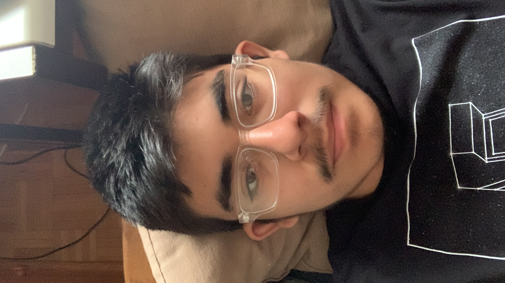

# Hello, I'm Alexis Pelaez 🦕 (AKA Zyle Kits)

## Background
I grew up in a relatively poor neighborhood in Chicago. It goes by the name of Little Village or South Lawndale. It is predominantly hispanic and that represents me. I am 100% Mexican by blood. Fun fact, despite growing up under a hispanic household, I never was able to learn the Spanish language. It has caused me problems in my family but I do my best to overcome them. I have lived here all my life and I plan to move someday!

## Image

## Positive Traits
- Hardworking
- Patient
- Supportive
- Independent
- Attention to detail

## Fun Facts
1. I am 16 years old
2. I am a first-generation student
3. I am very friendly and open to talking despite appearing aggressive
4. I want to become either an aerospace or electrical engineer
5. I love board games and I wish to create my own one day

## Contact
Email: pelaezalexis4864@gmail.com
<!--
**AlexisPelaez/AlexisPelaez** is a ✨ _special_ ✨ repository because its `README.md` (this file) appears on your GitHub profile.

Here are some ideas to get you started:

- 🔭 I’m currently working on ...
- 🌱 I’m currently learning ...
- 👯 I’m looking to collaborate on ...
- 🤔 I’m looking for help with ...
- 💬 Ask me about ...
- 📫 How to reach me: ...
- 😄 Pronouns: ...
- ⚡ Fun fact: ...
-->
